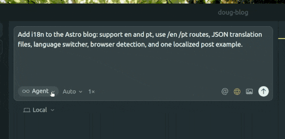

In the last few years, I’ve tried many coding AI tools like Copilot, but none of them have worked for as long as Cursor. For the first time, I’ve been feeling that AI is truly helping me build things faster and reduce the steps between ideas and code.

So, to celebrate that, I decided to share some of my favorite Cursor features!

---

## **Plan Mode**

Plan Mode was introduced recently in Cursor. The first time I saw this kind of implementation was with [Kiro](https://kiro.dev/), and I’m pretty sure this will become the default way we use AI to build things in the next few years (or months — who knows).

With this feature, AI doesn’t just implement something that could possibly work based on your prompt, it analyzes your codebase to understand how you do things, asks clarifying questions about what you’re implementing, and generates a plan that lets you think and reflect on whether what will be implemented is really what you need.

When using this feature, I always try to be careful with the output and not blindly follow the steps that the AI describes. I update the plan if necessary and add new requirements when the ones I gave aren’t clear enough. I also try to encourage the model to ask clarifying questions so it can better understand what I’m expecting and avoid misunderstandings.

Once the plan feels solid, we need to give the AI the right context to execute it.

---

## **Adding Context with `@`**

To solve problems effectively, AI needs context. The easiest way to add context in Cursor is by using the `@` command in the chat. It allows you to reference files, documentation, git history, the terminal, and even the integrated browser.

For me, the ones I use the most are `@docs`, `@files`, and `@git`.

With `@docs`, I can reference external library documentation such as Redux, Ruby on Rails, or React. This lets the agent provide more accurate suggestions and reduces hallucinations, since it can use updated documentation instead of relying on its training cutoff.

I often use the `@files` context when I need to show the agent exactly where a change should happen, like a file, folder, or specific lines or to provide context about already implemented features that can help with the current problem. This helps the agent follow the existing code patterns and stay consistent.

Lastly, using the `@git` command, I can pass the diff between my branch and `main` to the agent. This allows me to ask it to generate a PR description, document what was implemented, or perform a code review of my changes.

After adding context, the next step is to automate the repetitive parts of the process.

---

## **Using `/`**

For me, the main purpose of AI is to eliminate repetitive steps, so why keep writing the same prompt over and over again? Fortunately, Cursor has a great feature that helps with this: **custom commands**.

This feature allows you to save and standardize commands for common tasks and call them whenever needed in the chat by typing `/`. This lists all the available commands in your project.

For example, suppose you often use a command to generate PR descriptions and always have to include your team’s structure or checklist manually. You can avoid that by creating a new command file in your project root at `.cursor/commands` with a descriptive name like `generate-pr-description`.

The best part is that you can commit these commands to your git repository so that everyone on your team can access and use the same commands!

If you need inspiration to create your own commands, check out this repository, which contains a collection of useful Cursor commands: [Cursor Commands](https://github.com/hamzafer/cursor-commands).

Also, Eric Zakariasson recently shared on X that you can now share commands and rules via links! Check it out here:
[https://x.com/ericzakariasson/status/1983945740411138337](https://x.com/ericzakariasson/status/1983945740411138337)

Even with automation, though, sometimes a prompt doesn’t quite land. That’s where another simple but useful feature comes in.

---

## **Checkpoints**

Even when using all the features above, sometimes a prompt doesn’t generate exactly what you want or misses a requirement.

In these cases, you can use the **Checkpoints** feature by scrolling through the chat and clicking one of your previous prompts. This reverts your code to the state it was in when you sent that prompt and lets you modify it.

In my daily use, I find this really helpful when a prompt is missing a small requirement or detail that can help the agent generate a better output.

---

## **Conclusion**

Cursor is a powerful tool, and even after months of using it, I’m still discovering new, exciting features and better ways to optimize my workflow. The Cursor team releases frequent updates (sometimes more than one per day) that add or enhance existing functionality.

If you’re working on a team, I strongly recommend taking advantage of features like commands and Cursor rules. They’ll help your team get the most out of the tool together.

These features have completely changed how I code and I’m curious to hear which ones have done the same for you.

---
