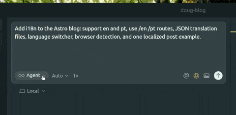

Nos últimos anos, experimentei várias ferramentas de IA para programação, como o Copilot, mas nenhuma permaneceu comigo por tanto tempo quanto o Cursor. Pela primeira vez, sinto que a IA está realmente me ajudando a construir coisas mais rápido e a reduzir as etapas entre as ideias e o código.

Então, para comemorar, decidi compartilhar alguns dos meus recursos favoritos do Cursor!

---

## **Modo de Planejamento**

O Modo de Planejamento foi introduzido recentemente no Cursor. A primeira vez que vi esse tipo de implementação foi com o [Kiro](https://kiro.dev/), e tenho quase certeza de que essa será a forma padrão de usarmos IA para construir coisas nos próximos anos (ou meses — quem sabe).

Com esse recurso, a IA não implementa apenas algo que talvez funcione com base no seu prompt. Ela analisa a sua base de código para entender como você faz as coisas, pergunta detalhes sobre o que está sendo implementado e gera um plano que permite pensar e refletir se aquilo que será construído é realmente o que você precisa.

Quando uso esse recurso, sempre tento analisar o resultado com cuidado e não seguir cegamente as etapas descritas pela IA. Atualizo o plano quando necessário e adiciono novos requisitos quando os que forneci não estão claros o suficiente. Também procuro incentivar o modelo a fazer perguntas para entender melhor o que espero e evitar mal-entendidos.

Quando o plano parece sólido, precisamos fornecer à IA o contexto certo para executá-lo.

---

## **Adicionando contexto com `@`**

Para resolver problemas de forma eficiente, a IA precisa de contexto. A maneira mais fácil de adicionar contexto no Cursor é usar o comando `@` no chat. Ele permite referenciar arquivos, documentação, histórico do Git, o terminal e até o navegador integrado.

Os que mais uso são `@docs`, `@files` e `@git`.

Com `@docs`, posso referenciar a documentação de bibliotecas externas como Redux, Ruby on Rails ou React. Isso permite que o agente forneça sugestões mais precisas e reduz alucinações, pois ele pode usar documentação atualizada em vez de depender apenas do limite de conhecimento do seu treinamento.

Costumo usar o contexto `@files` quando preciso mostrar ao agente exatamente onde uma alteração deve acontecer, como um arquivo, uma pasta ou linhas específicas, ou quando quero fornecer o contexto de recursos já implementados que podem ajudar no problema atual. Isso ajuda o agente a seguir os padrões existentes no código e a manter a consistência.

Por fim, usando o comando `@git`, posso passar ao agente o diff entre a minha branch e a `main`. Assim, posso pedir que ele gere a descrição de um PR, documente o que foi implementado ou faça uma revisão das minhas alterações.

Depois de adicionar contexto, o próximo passo é automatizar as partes repetitivas do processo.

---

## **Usando `/`**

Para mim, o principal objetivo da IA é eliminar etapas repetitivas. Então, por que continuar escrevendo o mesmo prompt várias vezes? Felizmente, o Cursor tem um ótimo recurso para ajudar nisso: os **comandos personalizados**.

Esse recurso permite salvar e padronizar comandos para tarefas comuns e chamá-los no chat sempre que necessário digitando `/`. Isso exibe todos os comandos disponíveis no projeto.

Por exemplo, imagine que você usa com frequência um comando para gerar descrições de PR e sempre precisa incluir manualmente a estrutura ou o checklist da sua equipe. Você pode evitar isso criando um novo arquivo de comando na raiz do projeto, em `.cursor/commands`, com um nome descritivo como `generate-pr-description`.

A melhor parte é que esses comandos podem ser adicionados ao repositório Git para que todas as pessoas da equipe tenham acesso e usem os mesmos comandos!

Se precisar de inspiração para criar seus próprios comandos, confira este repositório, que reúne vários comandos úteis para o Cursor: [Cursor Commands](https://github.com/hamzafer/cursor-commands).

Além disso, Eric Zakariasson compartilhou recentemente no X que agora é possível compartilhar comandos e regras por meio de links! Confira aqui:
[https://x.com/ericzakariasson/status/1983945740411138337](https://x.com/ericzakariasson/status/1983945740411138337)

Mesmo com a automação, às vezes um prompt não produz exatamente o resultado esperado. É aí que entra outro recurso simples, mas útil.

---

## **Checkpoints**

Mesmo usando todos os recursos acima, às vezes um prompt não gera exatamente o que você deseja ou deixa algum requisito de fora.

Nesses casos, você pode usar o recurso **Checkpoints**: basta navegar pelo chat e clicar em um dos prompts anteriores. Isso restaura o código ao estado em que estava quando aquele prompt foi enviado e permite modificá-lo.

No meu uso diário, isso é muito útil quando falta ao prompt um pequeno requisito ou detalhe que pode ajudar o agente a gerar um resultado melhor.

---

## **Conclusão**

O Cursor é uma ferramenta poderosa e, mesmo depois de meses de uso, continuo descobrindo recursos novos e interessantes e maneiras melhores de otimizar meu fluxo de trabalho. A equipe do Cursor lança atualizações frequentes — às vezes mais de uma por dia — que adicionam ou aprimoram funcionalidades.

Se você trabalha em equipe, recomendo muito aproveitar recursos como comandos e regras do Cursor. Eles ajudarão todo o time a aproveitar melhor a ferramenta em conjunto.

Esses recursos mudaram completamente a forma como eu programo, e tenho curiosidade de saber quais deles fizeram o mesmo por você.

---
