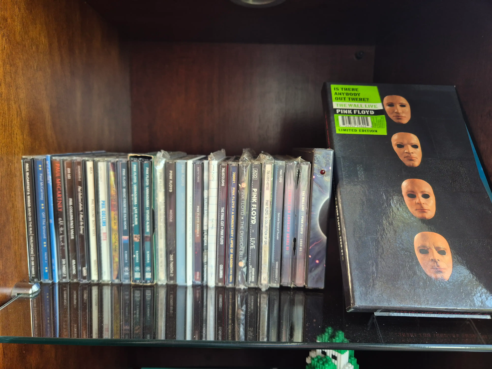
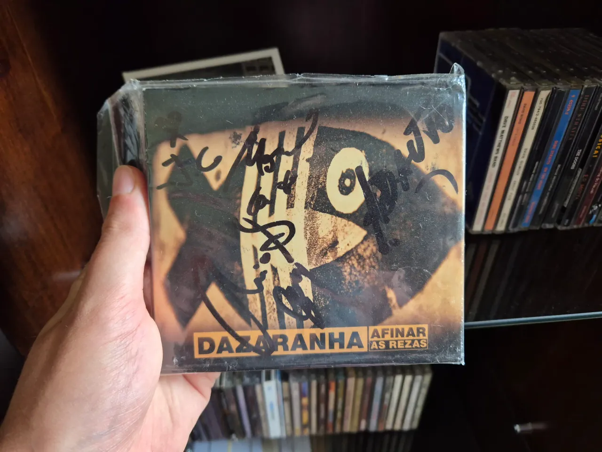

Music has always been an important part of my life. 

When I was a kid, I had a MP4 player that was the thing that connected and allowed me to listen some music that was downloaded at a lan house. After that, when I was a teenager, the music I listened to were downloaded through eMule and Ares and played in Windows Media Player while I was making miracles to make some games run on my Celeron e3200. Then, when I got my first smartphone the headphones kept playing an important role in my life whenever I went outside, first with the same downloaded MP3 and after with the advent of streaming, in spotify mostly of the time.
But, even music playing such an important role in my life, I didn't really own some music for many years, the connection between me and music existed but this has never been physically represented in some way.

In November 2023 I was just sitting in my bedroom and thinking about listening to some music and which are my favorite albums when I realized: Even music having such an important place in my life, there's no way for me to listen outside my computer or cellphone. There was a gap between how much music means to me and how little the physical presence it has in my life. 
So, I decided to bring the music I love to the material world and started buying some CDs.

 While streaming is a pretty good thing to discover new music and makes easier to more people access and listen to music it can make music feel weightless. Most of the time you're listening to music in the "flow" state, not actually choosing something and just listening to what the algorithm decided that you want to listen. Collecting gave weight back to my relation with music. 

When I look at my collection and go through all the CDs that I have, this is more than just looking at some medias that the only goal is to keep music files, they are more like **memory containers**, since each one can keep context of when and why they are bought, what I was looking to listen, how I was feeling and it could be even more special when it's a gift. 

One of the most special ones that I have is a [Dazaranha](https://en.wikipedia.org/wiki/Dazaranha) CD called "Afinar as Rezas", that I got as gift from my girlfriend almost two years ago. 

It might not be our favorite CD from the band, or our favorite band, but this means a lot to us, since we met for the first time at a Dazaranha show and the CD is autographed by the band! So, this is not only something that we could hear together, this is something that invokes a lot of memories and feelings for me every time I see it. All those elements combined together are what give me texture in my life. 

For me at the end, it's about building this life with texture thing. Things that have a history, that matter and I can choose deliberately. This is, in some ways, an autobiography of my taste and experiences. Obviously you do not need to start collecting CDs, music, photos or anything like these, but I do recommend that you find something that can connect you with your memories and add this kind of texture to your life.
